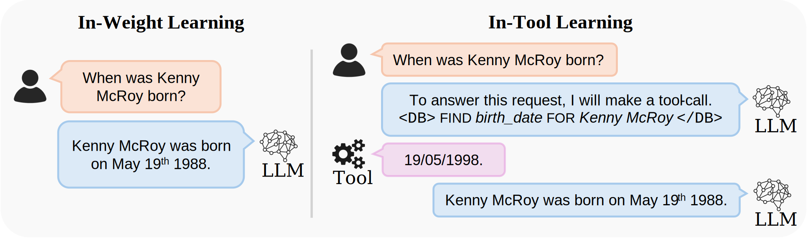

# 🛠️ Provable Benefits of In-Tool Learning (ITL)
[](https://arxiv.org/pdf/2508.20755)
[](https://creativecommons.org/licenses/by-nc/4.0/legalcode.en)

<!-- **This repository contains the official implementation of our study on the benefits of tool-use for LLMs** -->

<!-- >[Provable Benefits of In-Tool Learning for Large Language Models](https://arxiv.org/pdf/2508.20755). -->
**[Sam Houliston*](https://www.linkedin.com/in/sam-houliston-47364524a/?originalSubdomain=uk), [Ambroise Odonnat*](https://ambroiseodt.github.io/), [Charles Arnal*](https://charlesarnal.github.io/), [Vivien Cabannes*](https://viviencabannes.github.io/)**. ***Equal contribution**.

Our codebase provides utilities to train and study large language models from a memory and generalization perspective and allow tool-use (currently implemented as an SQL agent). It relies mainly on PyTorch primitives, instead of any high-level LLM libraries, allowing researchers and practitioners to easily prototype and modify.
<p align="center">
 
</p>

## 👋 Table of contents

* [🧐 Introduction](#-introduction-back-to-top)

* [🙌 Project Overview](#-project-overview-back-to-top)

* [📋 Getting Started with the CODE](#-getting-started-with-the-code-back-to-top)

* [📚 Getting Started with the DATA](#-getting-started-with-the-data-back-to-top)

* [💯 BigO(Bench) Scores](#-bigobench-scores-back-to-top)

* [🤗 Running BigO(Bench) on (your) HuggingFace Models](#-running-bigobench-on-your-huggingface-models-back-to-top)

* [👨‍💻 Running BigO(Bench) on OpenAI Models](#-running-bigobench-on-openai-models-back-to-top)

* [🤖 Running BigO(Bench) on anything else that runs !](#-running-bigobench-on-anything-else-that-runs--back-to-top)

* [🔬📈 Running the Dynamic Complexity Inference Framework on code snippets](#-running-the-dynamic-complexity-inference-framework-on-code-snippets-back-to-top)

* [🙏 Acknowledgements](#-acknowledgements-back-to-top)

* [License](#license-back-to-top)

* [📝 Citation](#-citation-back-to-top)

## Introduction <sub><sup>([back to top](#-overview))<sub><sup>

- 🛠️ In-tool learning: learning to use a tool (e.g., a calculator or a request to a database) to solve a problem,
- 🏋🏽 In-weight learning: memorizing the solution to a problem within the model's weights.

## Project overview

Our codebase is structured as follows:

```
🛠️ itl
┣ 📂src # Core library NanoLlama
┃ ┣ 📂nanollama
┃   ┣ 📂agent
┃   ┣ 📂data
┃   ┣ 📂inference
┃   ┣ 📂model
┃   ┣ 📂monitor
┃   ┣ 📂visualization
┃   ┣ 📄__init__.py
┃   ┣ 📄distributed.py
┃   ┣ 📄launcher.py
┃   ┣ 📄optim.py
┃   ┣ 📄tokenizer.py
┃   ┗ 📄utils.py
┣ 📂test # Unit tests
┗ 📂apps # In-tool learning with Nanollama
  ┣ 📂memory # Controlled study of memory load
  ┃ ┣ 📂compressibility
  ┃ ┣ 📂configs
  ┃ ┣ 📂datasets
  ┃ ┣ 📂generalization
  ┃ ┣ 📂plots
  ┃ ┣ 📂scripts
  ┃ ┣ 📄__init__.py
  ┃ ┣ 📄README.md
  ┃ ┣ 📄args.py
  ┃ ┣ 📄eval.py
  ┃ ┣ 📄local_grid.py
  ┃ ┣ 📄prompt_loader.py
  ┃ ┗ 📄train.py
  ┣ 📂large_scale # Large-scale experiments
  ┃ ┣ 📂data
  ┃ ┣ 📂training
  ┃ ┣ 📂Evaluation
  ┃ ┣ 📂plots
  ┃ ┣ 📄__init__.py
  ┗ ┗ 📄README.md

```

The folder ```src/nanollama``` contains the most reusable components, which can be put together in the ```apps``` folder for various applications. The code in ```apps/memory``` can be used to study the memory load of in-tool learning in a controlled setting and the code in ```apps/large_scale``` can be used to study in-tool learning at large scale.

## Getting started
We provide below the instructions to install the library and start launching experiments.

### Installation
The code runs Python 3.10+.
Here are some installation instructions:
- Install [miniconda](https://docs.conda.io/projects/miniconda/en/latest/). Follow the instructions online, most likely you will execute the following commands.
```bash
curl -O https://repo.anaconda.com/miniconda/Miniconda3-latest-Linux-x86_64.sh
bash ~/Miniconda3-latest-Linux-x86_64.sh
source ~/.bashrc
```
- Install Python in a new conda environment (be mindful to install a Python version compatible with Pytorch):
```bash
conda create -n llm python==3.12
conda activate llm
```

4. Install this repo (be mindful to install a Pytorch version compatible with your CUDA driver; use `nvidia-smi` to check your CUDA driver)
```bash
git clone <repo url>
cd <repo path>
pip install -e .
```
Optional dependencies, e.g. the LLM ones, can be added by swapping the previous command for the following one:
```bash
pip install -e ".[llm]"
```
More details are given in the README files of the apps folders.

> [!NOTE]
> LLM libraries such as [datasets](https://github.com/huggingface/datasets), [transformers](https://github.com/huggingface/transformers), [trl](https://github.com/huggingface/trl), or [lm-evaluation-harness](https://github.com/EleutherAI/lm-evaluation-harness) are subject to frequent changes which might impact the behavior of the codebase. In case of issues, we advise users to use previous versions of the packages.

### Using HuggingFace pretrained models
Some models are gated, e.g., the Llama ones, and users should request the access and login to the huggingface hub to use them in the scripts.
See https://huggingface.co/docs/hub/en/models-gated for more information.

### Development
To verify the your installation, run unit tests with the following command at the root of this repository
```bash
python -m unittest
```
It should return ```OK```.

### Launching jobs
Our codebase supports launching jobs with and without Slurm. See ```apps/memory/README.md``` for more details.

## Reproducing our experiments
Instructions to reproduce the experiments in our paper can be found in [apps/memory/README](apps/memory/README.md) and [apps/finetuning/README](apps/finetuning/README.md).

## Acknowledgments
This repository builds heavily on [lingua](https://github.com/facebookresearch/lingua) and [pal](https://github.com/facebookresearch/pal) which provide easy-to-use code to train and play with LLMs.

## License
The codebase is licensed under the [CC BY-NC 4.0 License](LICENSE.md).

## Citation
If you find this repository useful, please consider giving a star ⭐, and cite us as:
```
@misc{in_tool_learning,
  author = {Sam Houliston* and Ambroise Odonnat* and Charles Arnal* and Vivien Cabannes*},
  title = {{Provable Benefits of In-Tool Learning for Large Language Models}},
  url = {TBD},
  year = {2025}
}
```
