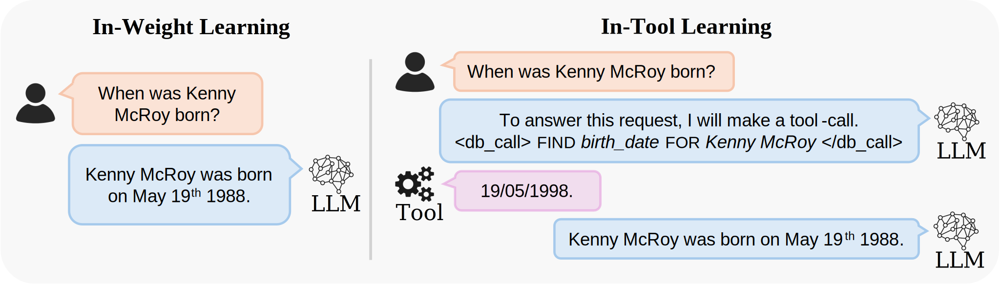

# NanoLlama
**[Sam Houliston*](https://www.linkedin.com/in/sam-houliston-47364524a/?originalSubdomain=uk)**, **[Ambroise Odonnat*](https://ambroiseodt.github.io/)**,**[Charles Arnal*](https://charlesarnal.github.io/)**, **[Vivien Cabannes*](https://viviencabannes.github.io/)**. ***Equal contribution**

This codebase provides utilities to train and study large language models, particularly from the point of view of memory and generalization.
It mostly relies on PyTorch primitives, instead of any high-level LLM libraries, allowing researchers and practitioners to easily prototype and modify. 
In the folder ```apps```, we show how this codebase can be used to study LLMs by providing the official implementation of *Provable Benefits of In-Tool Learning for Large Language Models*.

<p align="center">  
 
</p>

## Installation

The code runs Python 3.10+.
Here is some installation instruction:
1. Install [miniconda](https://docs.conda.io/projects/miniconda/en/latest/). Follow the instruction online, most likely you will execute the following commands.
```bash
curl -O https://repo.anaconda.com/miniconda/Miniconda3-latest-Linux-x86_64.sh
bash ~/Miniconda3-latest-Linux-x86_64.sh
source ~/.bashrc
```
2. Install python in a new conda environment: be mindful to install a version of python that is compatible with PyTorch.
```bash
conda create -n llm
conda activate llm
conda install pip python=3.12
```
3. Install Pytorch and check CUDA support: be mindful to install a version that is compatible with your CUDA driver ([example](https://docs.nvidia.com/cuda/cuda-toolkit-release-notes/index.html)) (use `nvidia-smi` to check your CUDA driver)
```bash
pip install torch --index-url https://download.pytorch.org/whl/cu121
python -c "import torch; print(torch.cuda.is_available())"
```
This should print "True".
4. Install this repo
```bash
git clone <repo url>
cd <repo path>
pip install -e .
```
If you want to install the development, visualization and mamba dependencies, you can swap the previous command for the following one:
```bash
pip install -e ".[dev,ssm,visu]"
```

#### Mamba specific instructions
For mamba, `causal_conv1d` can be a bit hard to load, as it is built upon environment variables that are not always set.
If you are on a cluster utilizing `module`, you may want to set `CUDA_HOME` with
```bash
module load cuda/<latest version>
```
You may instantiate the path to `nvjitlink` with
```bash
export LD_LIBRARY_PATH=$(python -c "import site; print(site.getsitepackages()[0] + '/nvidia/nvjitlink/lib')"):$LD_LIBRARY_PATH
```
You can then try to install the package with `ssm` dependencies (namely `causal_conv1d` and `mamba_ssm`)
```bash
pip install -e .[ssm]
```

## Contributing
To contribute to this codebase, please refer to [contributing](https://github.com/VivienCabannes/memory/blob/main/CONTRIBUTING.md) and the [code of conduct](https://github.com/VivienCabannes/memory/blob/main/CODE_OF_CONDUCT.md).

#### Development
Run unit tests with the following command at the root of this repository
```bash
python -m unittest
```

#### Code convention
- Avoid packages that are not well maintained
- If using heavy/hard-to-install packages that are not mandatory, make sure that the code still run if people do not install these packages
- Make sure that the code is open-source-able.
- Name `build_<method>` any method that initialize a class.
- Use Object-Oriented Programming, as well as Context-Oriented Programming.
- Make sure that the code can run on CPU and V100 (so that people can easily develop from their own laptop without connection on small datasets).
 - Use Stateful object to be able to relaunch training whenever it crashes.

## Aknowledgments
This repository builds heavily on [Meta Lingua](https://github.com/facebookresearch/lingua), which provides minimalist code to pretrain large language models.

## Citation
If you find this repository useful, please consider giving a star ⭐, and cite us as:
```
@misc{in-tool_learning,
  author = {Sam Houliston* and Ambroise Odonnat* and Charles Arnal* and Vivien Cabannes*},
  title = {{Provable Benefits of In-Tool Learning for Large Language Models}},
  url = {TBD},
  year = {2025}
}
```

## License
NanoLlama is licensed under the [CC BY-NC 4.0 License](https://github.com/VivienCabannes/memory/blob/main/LICENSE.md).

